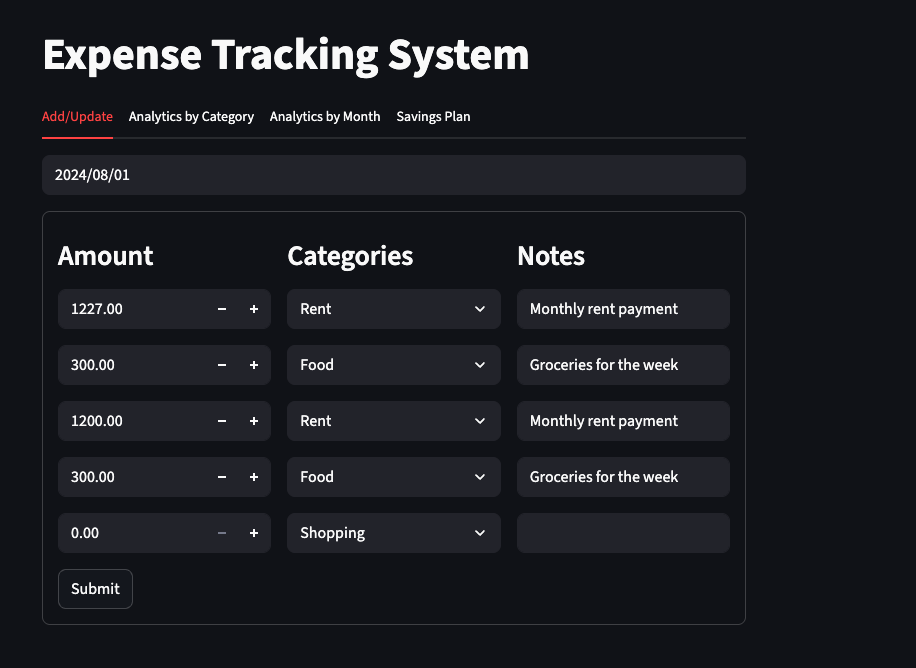
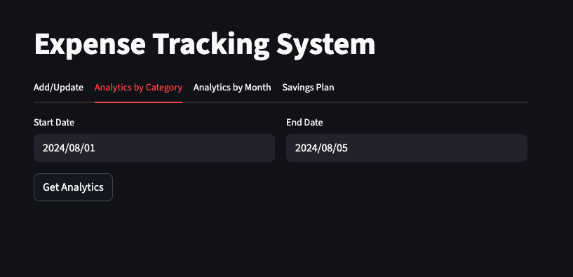
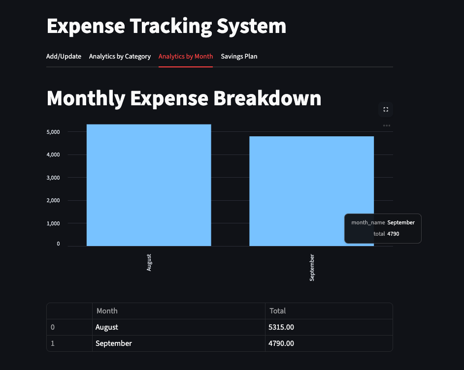
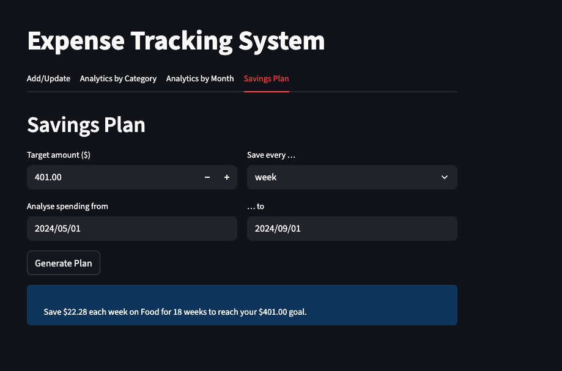

# Expense Tracking System

> Personal finance management with a twist of ancient wisdom

[](https://www.python.org/downloads/)
[](https://fastapi.tiangolo.com/)
[](https://streamlit.io/)

A lightweight expense management system combining a **Streamlit** frontend with a **FastAPI** backend. Track daily expenses, visualize spending patterns, generate savings plans, and receive financial insights paired with **Sanskrit wisdom** from texts like the Arthaśāstra.

<p align="center">
  
</p>

---

## Features

| Tab | Description |
|-----|-------------|
| **Add/Update** | Log daily expenses by category with notes |
| **Analytics by Category** | Pie charts and breakdowns of spending categories |
| **Analytics by Month** | Track spending trends over time |
| **Savings Plan** | Generate personalized savings targets based on discretionary spending |
| **Artha Insights** | *NEW* — Financial health score + Sanskrit wisdom on wealth |

---

## Artha Insights — What Makes This Unique

<p align="center">
  
</p>

*Artha* (अर्थ) is one of the four Puruṣārthas—the aims of human life in Hindu philosophy, representing prosperity and economic security pursued ethically.

### Lakshmi Score

A financial health metric (0-100) named after the goddess of wealth. The score evaluates:

- **Essential vs. discretionary** spending ratio
- **Diversification** across categories
- **Spending concentration** (penalizes over-reliance on one category)

| Score | Grade | Meaning |
|-------|-------|---------|
| 85-100 | Kuber | Excellent discipline (named after the god of wealth) |
| 70-84 | Śreṣṭha | Strong financial health |
| 55-69 | Madhyama | Moderate, room for optimization |
| 40-54 | Sādhāraṇa | Needs attention |
| 0-39 | Cintanīya | Requires immediate focus |

### Sanskrit Wisdom

Curated shlokas from classical texts on wealth management:

> **अल्पानामपि वस्तूनां संहतिः कार्यसाधिका**
> *alpānāmapi vastūnāṃ saṃhatiḥ kāryasādhikā*
> "Even small things, when accumulated, accomplish great tasks."
> — Cāṇakya Nīti 15.14

The system selects contextually relevant wisdom based on your spending patterns—encouraging savings when you're doing well, offering gentle guidance when overspending.

---

## Tech Stack

- **Frontend**: Streamlit
- **Backend**: FastAPI
- **Database**: MySQL
- **Architecture**: REST API with Pydantic models

---

## Project Structure

```
expense-tracking-system/
├── frontend/
│   ├── app.py                    # Main Streamlit app
│   ├── add_update.py             # Expense entry tab
│   ├── analytics_by_category.py  # Category analytics
│   ├── analytics_by_month.py     # Monthly trends
│   ├── savings_plan.py           # Savings calculator
│   └── artha_insights.py         # Lakshmi Score + Sanskrit wisdom
├── backend/
│   ├── server.py                 # FastAPI endpoints
│   ├── db_helper.py              # MySQL queries
│   └── logging_setup.py          # Logging configuration
├── test/                         # Pytest test suite
├── requirements.txt
└── README.md
```

---

## Installation

### Prerequisites

- Python 3.10+
- MySQL server with a database called `expense_manager`

### Database Setup

```sql
CREATE DATABASE expense_manager;
USE expense_manager;

CREATE TABLE expenses (
    id INT AUTO_INCREMENT PRIMARY KEY,
    expense_date DATE NOT NULL,
    amount DECIMAL(10,2) NOT NULL,
    category VARCHAR(50),
    notes TEXT
);
```

### Run the App

```bash
# Clone the repository
git clone https://github.com/vi5hnuiyengar/Expense-Tracking-System.git
cd Expense-Tracking-System

# Create virtual environment
python -m venv venv
source venv/bin/activate  # Windows: venv\Scripts\activate

# Install dependencies
pip install -r requirements.txt

# Configure database credentials in backend/db_helper.py

# Start backend (terminal 1)
uvicorn backend.server:app --reload

# Start frontend (terminal 2)
streamlit run frontend/app.py
```

---

## API Reference

| Method | Endpoint | Description |
|--------|----------|-------------|
| `GET` | `/expenses/{date}` | Get all expenses for a date |
| `POST` | `/expenses/{date}` | Add/update expenses for a date |
| `POST` | `/analytics` | Get category breakdown for date range |
| `GET` | `/analytics/monthly` | Get month-by-month totals |
| `POST` | `/savings_plan` | Generate savings recommendations |

### Example: Savings Plan Request

```bash
curl -X POST http://localhost:8000/savings_plan \
  -H "Content-Type: application/json" \
  -d '{
    "target": 500,
    "start_date": "2024-01-01",
    "end_date": "2024-03-31",
    "period": "month"
  }'
```

---

## Screenshots

<table>
<tr>
<td><br/><sub>Add/Update Expenses</sub></td>
<td><br/><sub>Category Analytics</sub></td>
</tr>
<tr>
<td><br/><sub>Monthly Trends</sub></td>
<td><br/><sub>Savings Plan</sub></td>
</tr>
</table>

---

## Customization

| What | Where | How |
|------|-------|-----|
| Mandatory expense categories | `backend/server.py` | Edit the `mandatory = {...}` set |
| Lakshmi Score algorithm | `frontend/artha_insights.py` | Modify `compute_lakshmi_score()` |
| Sanskrit quotes | `frontend/artha_insights.py` | Add to `ARTHA_WISDOM` list |
| Database credentials | `backend/db_helper.py` | Update connection parameters |
| UI theme | `frontend/app.py` | Edit the CSS style block |

---

## License

MIT License - see [LICENSE](LICENSE) for details.

---

<p align="center">
  <sub>Built with Python, powered by ancient wisdom.</sub>
</p>
