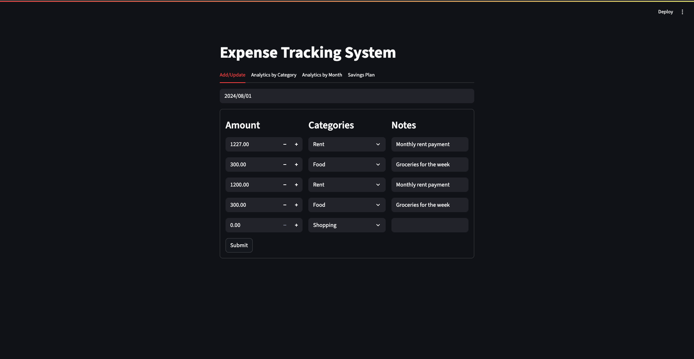

# Expense Management System

This project is an expense management system that consists of a Steamlit frontend application and a FastAPI backend server.


## Project Structure

- **frontend/**: Contains the Streamlit application code.
- **backend/**: Contains the FastAPI backend server code.
- **tests/**: Contains the test cases for both frontend and backend
- **requirements.txt/**: Lists the required Python packages.
- **README.md**/ Provides an overview and instructions for the project.


## Setup Instructions

1. **Clone the repository**:
   ```bash
    git clone https://github.com/yourusername/expense-management-system
   cd expense-management-system
   ```
2. **Install dependencies**:
    ```commandline
   pip install -r requirements.txt
    ``` 
3. **Run the FastAPI server**:

    ```commandline
    uvicorn server.server:app --reload
    ```
4. **Run the Streamlit app**:

    ```commandline
    streamlit run frontend/app.py
    ```


A lightweight **FastAPI + Streamlit** app for logging daily expenses, viewing
analytics, **and now generating a personalised savings plan** (v 1.1).



---

## ✨ What’s new in 1.1
| Feature | Notes                                                                                                                                                      |
|---------|------------------------------------------------------------------------------------------------------------------------------------------------------------|
| **Savings Plan tab** | Enter a target (e.g. “save \$1 000”), date range and frequency. The app analyses discretionary spend and tells you exactly how much to cut each week/month. |
| **Dark-mode facelift** | Simple sans font, buttons/headings, dark-mode.                                                                                                   |
| **Mandatory-expense filter** | Rent, mortgage, utilities, insurance and taxes are never suggested as cut-back categories.                                                                 |

---

## Prerequisites
* Python 3.9+ (tested on 3.10)
* MySQL server with a database called `expense_manager`
* A table `expenses`:

```sql
CREATE TABLE expenses (
    id INT AUTO_INCREMENT PRIMARY KEY,
    expense_date DATE NOT NULL,
    amount DECIMAL(10,2) NOT NULL,
    category VARCHAR(50),
    notes TEXT
);
```
# Setup

 1. **clone + install**
 ```
git clone https://github.com/your-handle/project_expense_tracking.git
cd project_expense_tracking
python -m venv .venv && source .venv/bin/activate
pip install -r requirements.txt
```
2. **configure DB creds (edit backend/db_helper.py or use env vars)**
3. **run**
```
uvicorn backend.server:app --reload     # terminal 1
streamlit run frontend/app.py           # terminal 2
```

## API Quick Reference

| Method | Route                    | Description                              |
|--------|--------------------------|------------------------------------------|
| GET    | `/expenses/{date}`       | Return all expense rows for the date     |
| POST   | `/expenses`              | Insert a new expense record              |
| GET    | `/analytics`             | Category-level totals                    |
| GET    | `/analytics/monthly`     | Month-by-month totals                    |
| POST   | `/savings_plan` (NEW)    | Suggest weekly / monthly cut-backs to hit a target |

---

### Example — generate a savings plan

```http
POST /savings_plan HTTP/1.1
Host: localhost:8000
Content-Type: application/json

{
  "target": 500,
  "start_date": "2024-05-01",
  "end_date":   "2024-09-06",
  "period":     "week"
}
```

## Customization
| File / Location                | What you can customise                               | How to do it                                                             |
|--------------------------------|------------------------------------------------------|--------------------------------------------------------------------------|
| `frontend/app.py`              | **Global theme** – fonts, colours, button look       | Edit the `<style>` block (CSS) near the top of the file                  |
| `frontend/app.py`              | **Tab names / order**                                | Adjust the `st.tabs([...])` list and corresponding `with tab:` sections  |
| `frontend/savings_plan.py`     | **Sentence wording** for the savings advice          | Edit the `st.write(...)` line that builds the final message              |
| `backend/server.py`            | **Mandatory-expense filter** (rent, utilities, …)    | Update the `mandatory = {...}` set inside `savings_plan()`               |
| `backend/server.py`            | **Logic** for per-period calculation                 | Tweak the math in `savings_plan()`                                       |
| `backend/db_helper.py`         | **Database credentials & table names**               | Change the connection params at the top; alter SQL queries if needed     |
| environment variables / `.env` | **API_URL**, host, ports for deployment              | Export new values or edit your `.env` before starting Uvicorn/Streamlit  |